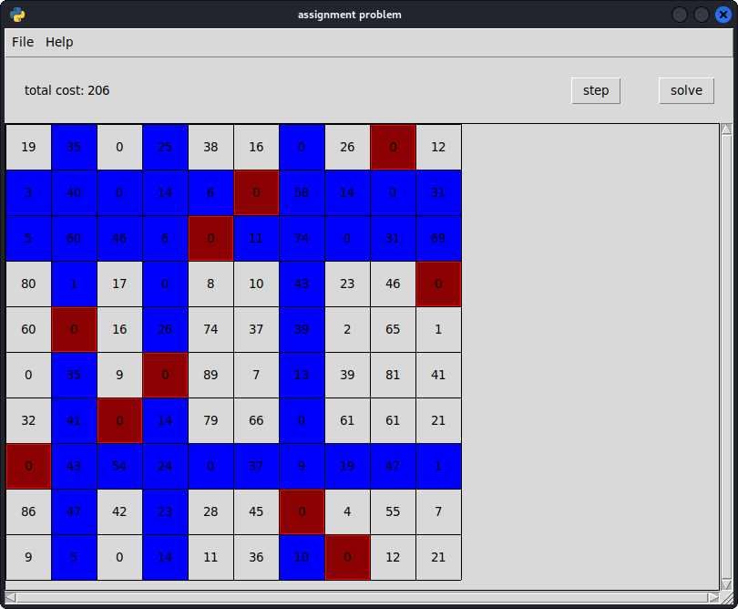

# Assignment problem

implementation of the Hungarian algorithm in python3



## Description

implementation of the Hungarian algorithm in python3, the solution implements a graphical user interface 
using tkinter, you can also import data sets from external CSV files

## Getting Started

### Dependencies

* mainly built for Linux (Ubuntu), can probably work just fine on Windows and macOS.
* Python3.7+
* python3-tk

you can also use the `requirements.txt` file to install python deps.

(note that those deps aren't tested to support different environments, they may work and they may not)

### Installing and Executing

* download source code and get started
```sh
git clone https://github.com/lrdtfkwth/assignment-problem.git && cd assignment-problem/src
python3 main.py
```

## License

This project is licensed under the MIT License - see the [LICENSE](LICENSE) file for details

## Acknowledgments

Inspiration, code snippets, etc.
* [SciPy library](https://github.com/scipy/scipy)
* [Munkres implementation for Python](http://software.clapper.org/munkres/)
* [SciPy implementation](https://github.com/scipy/scipy/blob/v0.18.1/scipy/optimize/_hungarian.py#L13-L107)
